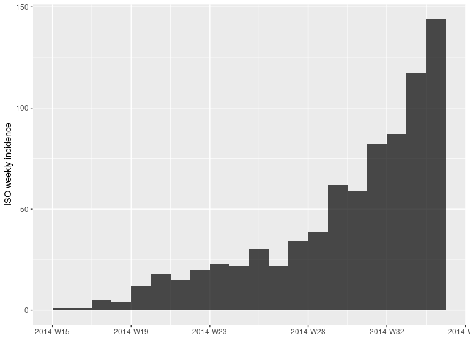
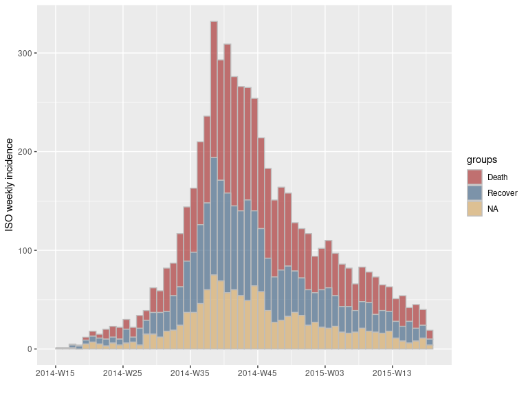

<br>

[](https://travis-ci.org/reconhub/incidence)

[](https://codecov.io/github/reconhub/incidence?branch=master)

[](https://cran.r-project.org/package=incidence)


<br>
<br>

# Installing the package

To install the current stable, CRAN version of the package, type:

```r
install.packages("incidence")
```

To benefit from the latest features and bug fixes, install the development, *github* version of the package using:

```r
devtools::install_github("reconhub/incidence")
```

Note that this requires the package *devtools* installed.


<br>
<br>

# What does it do?

The main functions of the package include:

- **`incidence`**: compute incidence from dates in various formats; any fixed time interval can be used; the returned object is an instance of the (S3) class *incidence*.
- **`plot`**: this method (see `?plot.incidence` for details) plots *incidence* objects, and can also add predictions of the model(s) contained in an  *incidence_fit* object (or a list of such objects).
- **`fit`**: fit one or two exponential models (i.e. linear regression on log-incidence) to an *incidence* object; two models are calibrated only if a date is provided to split the time series in two (argument `split`); this is typically useful to model the two phases of exponential growth, and decrease of an outbreak; each model returned is an instance of the (S3) class *incidence_fit*, each of which contains various useful information (e.g. growth rate *r*, doubling/halving time, predictions and confidence intervals).
- **`fit_optim_split`**: finds the optimal date to split the time series in two, typically around the peak of the epidemic.
- **`[`**: lower-level subsetan of *incidence* objects, permiting to specify which dates and groups to retain; uses a syntax similar to matrices, i.e. `x[i, j]`, where `x` is the *incidence* object, `i` a subset of dates, and `j` a subset of groups.
- **`subset`**: subset an *incidence* object by specifying a time window.
- **`pool`**: pool incidence from different groups into one global incidence time series.
- **`as.data.frame`**: converts an *incidence* object into a `data.frame` containing dates and incidence values.


<br>
<br>

# Resources

<br>

## Vignettes

An overview of *incidence* is provided below in the worked example below.
More detailed tutorials are distributed as vignettes with the package:

```r
vignette(package="incidence")
```

To open these, type:

```r
vignette("overview", package="incidence")
vignette("customize_plot", package="incidence")
vignette("incidence_class", package="incidence")
```

<br>

## Websites

The following websites are available:

- The official *incidence* website, providing an overview of the package's functionalities, up-to-date tutorials and documentation: <br>
[http://www.repidemicsconsortium.org/incidence/](http://www.repidemicsconsortium.org/incidence/)

- The *incidence* project on *github*, useful for developers, contributors, and users wanting to post issues, bug reports and feature requests: <br>
[http://github.com/reconhub/incidence](http://github.com/reconhub/incidence)

- The *incidence* page on CRAN: <br>
[http://cran.r-project.org/web/packages/incidence/index.html](http://cran.r-project.org/web/packages/incidence/index.html)


<br>

## Getting help online

Bug reports and feature requests should be posted on *github* using the [*issue*](http://github.com/reconhub/incidence/issues) system. All other questions should be posted on the **RECON forum**:
[http://www.repidemicsconsortium.org/forum/](http://www.repidemicsconsortium.org/forum/)


<br>
<br>

# A quick overview

The following worked example provides a brief overview of the package's
functionalities. For a complete introduction, see the `overview` vignette:
```{r, eval = FALSE} vignette("overview", package="incidence") ```


## Loading the data

This example uses the simulated Ebola Virus Disease (EVD) outbreak from the
package [*outbreaks*](http://github.com/reconhub/outbreaks). We will compute
incidence for various time steps, calibrate two exponential models around the
peak of the epidemic, and analyse the results.

First, we load the data:

```r
library(outbreaks)
library(ggplot2)
library(incidence)

dat <- ebola.sim$linelist$date.of.onset
class(dat)
#> [1] "Date"
head(dat)
#> [1] "2014-04-07" "2014-04-15" "2014-04-21" "2014-04-27" "2014-04-26"
#> [6] "2014-04-25"
```


## Computing and plotting incidence
We compute the weekly incidence:

```r
i.7 <- incidence(dat, interval=7)
i.7
#> <incidence object>
#> [5888 cases from days 2014-04-07 to 2015-04-27]
#> 
#> $counts: matrix with 56 rows and 1 columns
#> $n: 5888 cases in total
#> $dates: 56 dates marking the left-side of bins
#> $interval: 7 days
#> $timespan: 386 days
plot(i.7)
```


`incidence` can also compute incidence by specified groups using the `groups` argument. For instance, we can compute the weekly incidence by gender:

```r
i.7.sex <- incidence(dat, interval=7, groups = ebola.sim$linelist$gender)
i.7.sex
#> <incidence object>
#> [5888 cases from days 2014-04-07 to 2015-04-27]
#> [2 groups: f, m]
#> 
#> $counts: matrix with 56 rows and 2 columns
#> $n: 5888 cases in total
#> $dates: 56 dates marking the left-side of bins
#> $interval: 7 days
#> $timespan: 386 days
plot(i.7.sex, stack = TRUE, border = "grey")
```


## Handling `incidence` objects
`incidence` objects can be manipulated easily. The `[` operator implements subetting of dates (first argument) and groups (second argument). 
For instance, to keep only the first 20 weeks of the epidemic:

```r
i.7[1:20]
#> <incidence object>
#> [797 cases from days 2014-04-07 to 2014-08-18]
#> 
#> $counts: matrix with 20 rows and 1 columns
#> $n: 797 cases in total
#> $dates: 20 dates marking the left-side of bins
#> $interval: 7 days
#> $timespan: 134 days
plot(i.7[1:20])
```



Some temporal subsetting can be even simpler using `subset`, which permits to retain data within a specified time window:

```r
i.tail <- subset(i.7, from=as.Date("2015-01-01"))
i.tail
#> <incidence object>
#> [1156 cases from days 2015-01-05 to 2015-04-27]
#> 
#> $counts: matrix with 17 rows and 1 columns
#> $n: 1156 cases in total
#> $dates: 17 dates marking the left-side of bins
#> $interval: 7 days
#> $timespan: 113 days
plot(i.tail, border="white")
```


Subsetting groups can also matter. For instance, let's try and visualise the incidence based on onset of symptoms by outcome:

```r
i.7.outcome <- incidence(dat, 7, groups=ebola.sim$linelist$outcome)
i.7.outcome
#> <incidence object>
#> [5888 cases from days 2014-04-07 to 2015-04-27]
#> [3 groups: Death, NA, Recover]
#> 
#> $counts: matrix with 56 rows and 3 columns
#> $n: 5888 cases in total
#> $dates: 56 dates marking the left-side of bins
#> $interval: 7 days
#> $timespan: 386 days
plot(i.7.outcome, stack = TRUE, border = "grey")
```




Groups can also be collapsed into a single time series using `pool`:

```r
i.pooled <- pool(i.7.outcome)
i.pooled
#> <incidence object>
#> [5888 cases from days 2014-04-07 to 2015-04-27]
#> 
#> $counts: matrix with 56 rows and 1 columns
#> $n: 5888 cases in total
#> $dates: 56 dates marking the left-side of bins
#> $interval: 7 days
#> $timespan: 386 days
identical(i.7$counts, i.pooled$counts)
#> [1] TRUE
```


## Modelling incidence

Incidence data, excluding zeros, can be modelled using log-linear regression of the form:
log(*y*) = *r* x *t* + *b*

where *y* is the incidence, *r* is the growth rate, *t* is the number of days since a specific point in time (typically the start of the outbreak), and *b* is the intercept.

Such model can be fitted to any incidence object using `fit`.
Of course, a single log-linear model is not sufficient for modelling our time series, as there is clearly an growing and a decreasing phase.
As a start, we can calibrate a model on the first 20 weeks of the epidemic:


```r
plot(i.7[1:20])
```


```r
early.fit <- fit(i.7[1:20])
early.fit
#> <incidence_fit object>
#> 
#> $lm: regression of log-incidence over time
#> 
#> $info: list containing the following items:
#>   $r (daily growth rate):
#> [1] 0.03175771
#> 
#>   $r.conf (confidence interval):
#>           2.5 %     97.5 %
#> [1,] 0.02596229 0.03755314
#> 
#>   $doubling (doubling time in days):
#> [1] 21.8261
#> 
#>   $doubling.conf (confidence interval):
#>         2.5 %   97.5 %
#> [1,] 18.45777 26.69823
#> 
#>   $pred: data.frame of incidence predictions (20 rows, 5 columns)
```

The resulting objects can be plotted, in which case the prediction and its confidence interval is displayed:


```r
plot(early.fit)
```


However, a better way to display these predictions is adding them to the incidence plot using the argument `fit`:

```r
plot(i.7[1:20], fit = early.fit)
```


In this case, we would ideally like to fit two models, before and after the peak of the epidemic.
This is possible using the following approach, in which the best possible splitting date (i.e. the one maximizing the average fit of both models), is determined automatically:

```r
best.fit <- fit_optim_split(i.7)
best.fit
#> $df
#>         dates   mean.R2
#> 1  2014-08-04 0.7650406
#> 2  2014-08-11 0.8203351
#> 3  2014-08-18 0.8598316
#> 4  2014-08-25 0.8882682
#> 5  2014-09-01 0.9120857
#> 6  2014-09-08 0.9246023
#> 7  2014-09-15 0.9338797
#> 8  2014-09-22 0.9339813
#> 9  2014-09-29 0.9333246
#> 10 2014-10-06 0.9291131
#> 11 2014-10-13 0.9232523
#> 12 2014-10-20 0.9160439
#> 13 2014-10-27 0.9071665
#> 
#> $split
#> [1] "2014-09-22"
#> 
#> $fit
#> $fit$before
#> <incidence_fit object>
#> 
#> $lm: regression of log-incidence over time
#> 
#> $info: list containing the following items:
#>   $r (daily growth rate):
#> [1] 0.02982209
#> 
#>   $r.conf (confidence interval):
#>           2.5 %     97.5 %
#> [1,] 0.02608945 0.03355474
#> 
#>   $doubling (doubling time in days):
#> [1] 23.24274
#> 
#>   $doubling.conf (confidence interval):
#>         2.5 %  97.5 %
#> [1,] 20.65721 26.5681
#> 
#>   $pred: data.frame of incidence predictions (25 rows, 5 columns)
#> 
#> $fit$after
#> <incidence_fit object>
#> 
#> $lm: regression of log-incidence over time
#> 
#> $info: list containing the following items:
#>   $r (daily growth rate):
#> [1] -0.01016191
#> 
#>   $r.conf (confidence interval):
#>            2.5 %       97.5 %
#> [1,] -0.01102526 -0.009298561
#> 
#>   $halving (halving time in days):
#> [1] 68.21031
#> 
#>   $halving.conf (confidence interval):
#>         2.5 %   97.5 %
#> [1,] 62.86899 74.54349
#> 
#>   $pred: data.frame of incidence predictions (32 rows, 5 columns)
#> 
#> 
#> $plot
```


```r
plot(i.7, fit=best.fit$fit)
```


<br>
<br>

# Contributors (by alphabetic order):
- Thibaut Jombart (@thibautjombart)
- Rich Fitzjohn (@richfitz)

Contributions are welcome via pull requests.

Please note that this project is released with a [Contributor Code of Conduct](CONDUCT.md). By participating in this project you agree to abide by its terms.

**Maintainer:** Thibaut Jombart (thibautjombart@gmail.com)
